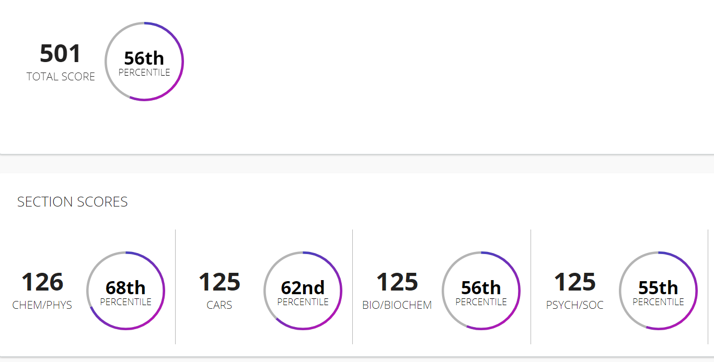

# MCAT
Making everything open source for studying my mcat  
Took Kaplan test - 501, 56th percentile (6-22-2021)

Took Half Length test by Blueprint - 500, 51st percentile (6-28-2021)
\BlueprintHalfTestScore.png)
