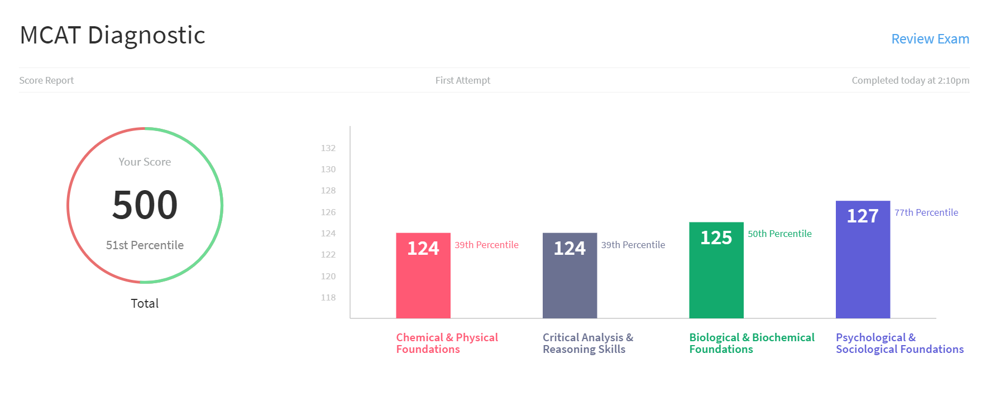
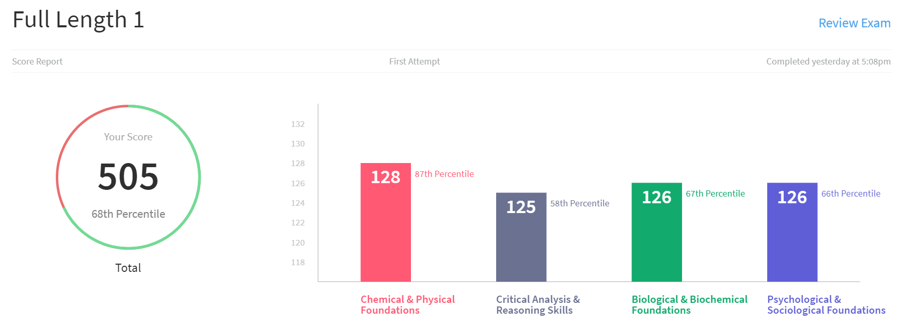
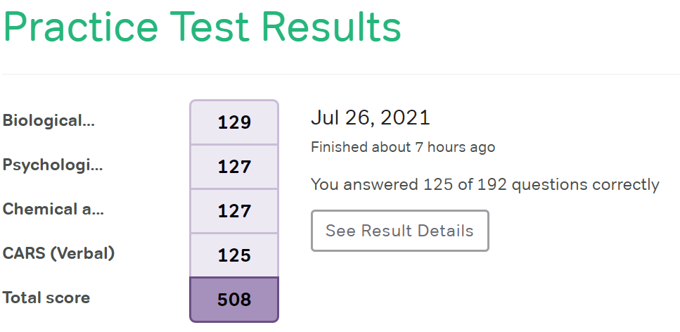
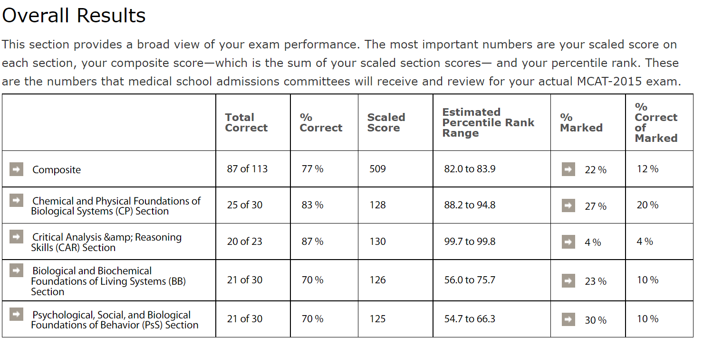
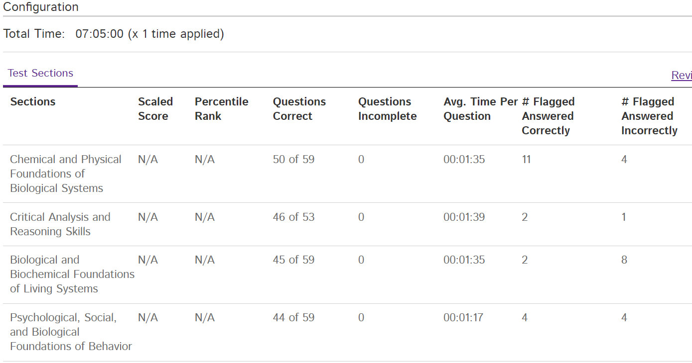
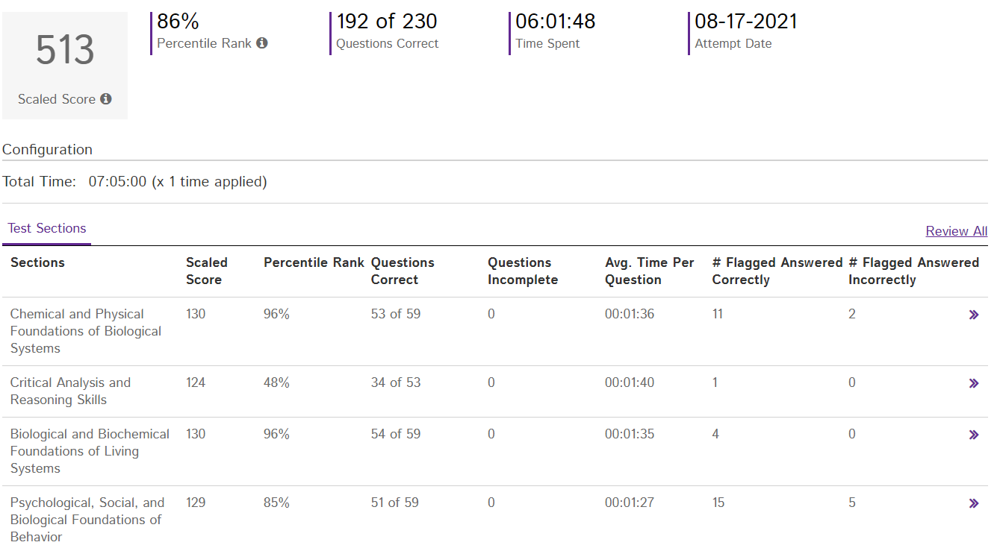
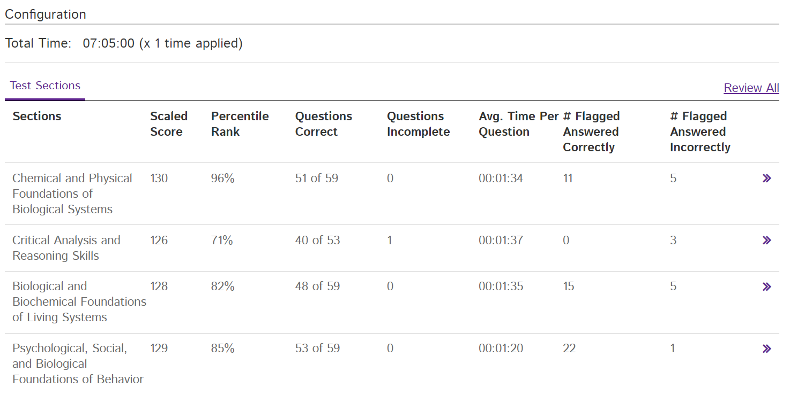
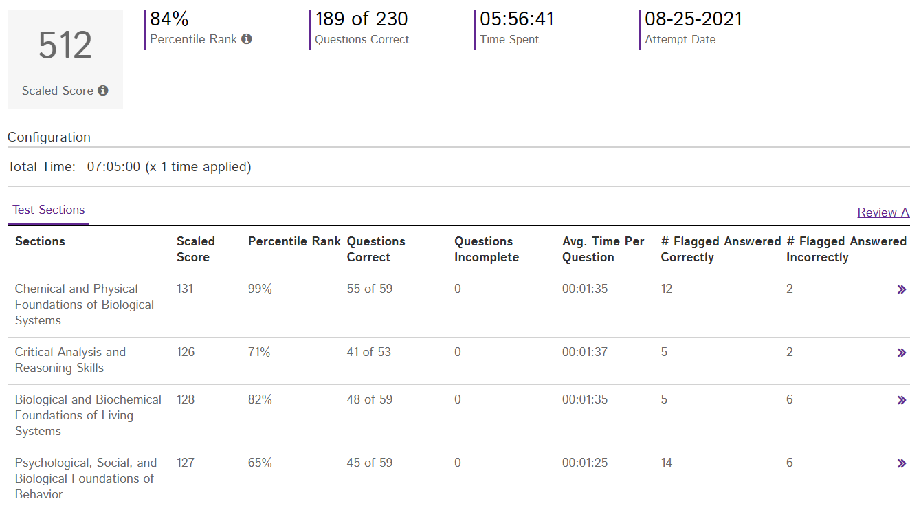
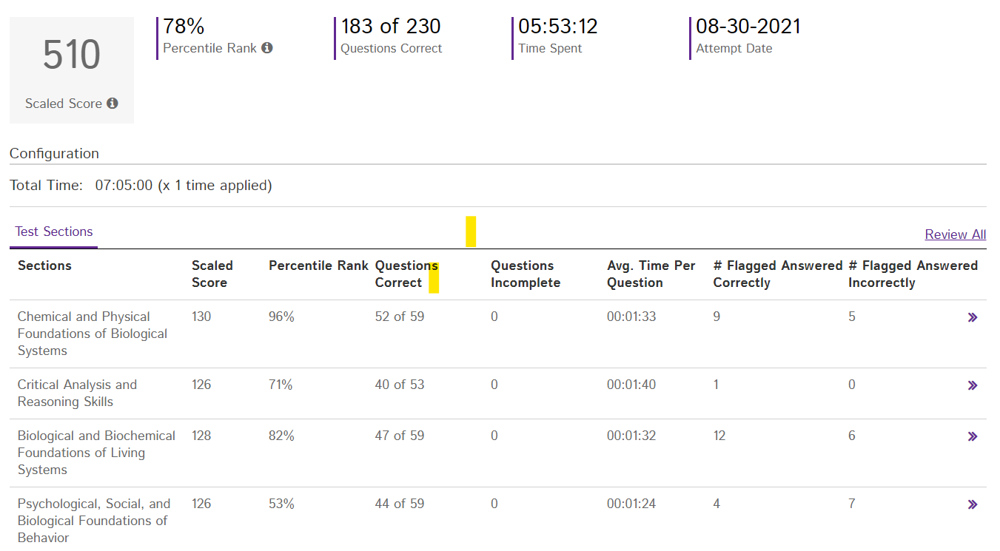

# MCAT
Making everything open source for studying my mcat
 ---   
Took Kaplan test - 501, 56th percentile (6-22-2021)

 ---
Took Half Length test by Blueprint - 500, 51st percentile (6-28-2021)

 ---
Studied Khan Academy Biomolecules, Week of 6-28
 ---
Took Full Length test by Blueprint - 505, 68th percentile (7-5-2021)

 ---
Spent weeks just doing content review
 ---
Took slightly shorter test by Magoosh - 508 (7-26-2021)

---
Took Half Length Altius - 509 (8-3-2021)

---
Took AAMC Sample Test - 511 (8-12-2021)

---
Took AAMC FL 1 - 513 (8-17-2021) (16 days before)

---
Took AAMC FL 2 - 513 (8-20-2021) (13 days before)

---
Took AAMC FL 3 - 512 (8-25-2021) (8 days before)

---
Took AAMC FL 4 - --- (8-30-2021) (3 days before)

---
Test is 9-2-2021